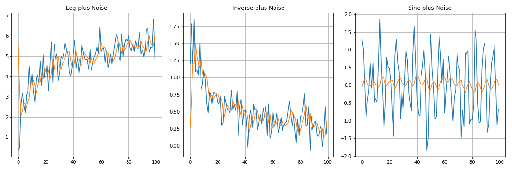

# Exponential Smoothing Layers

1. Tensorflow/Keras layer for simple exponential smoothing (SES)

- ses.py contains the layer defined for simple exponential smoothing
- main.py is an example for training the layer

  <b> Example of time series fit with simple exponential smoothing layer</b>

